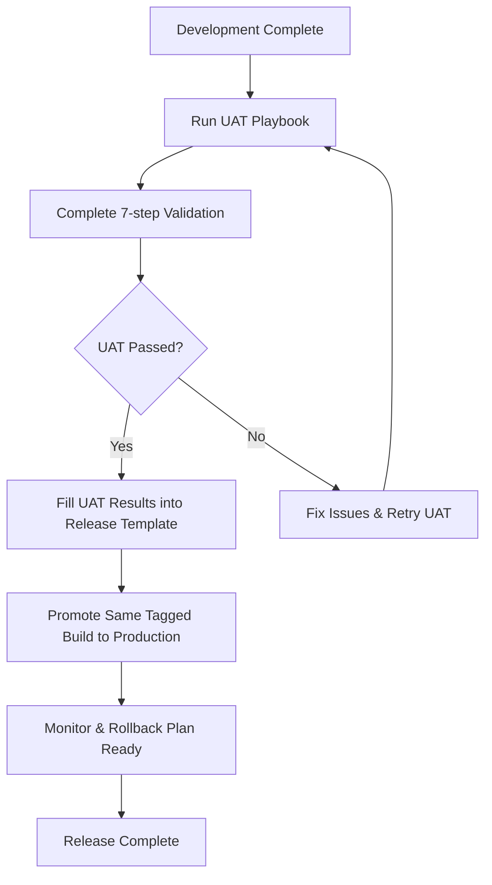

# 📖 UnlockMyLead Deployment Docs

Welcome to the UnlockMyLead Platform deployment documentation. This directory contains comprehensive guides for deploying and managing releases in both UAT and production environments.

---

## 🔧 Deployment Playbooks

### [UAT Deployment Playbook](./FINAL_Deployment_UAT_Playbook.md)
**→ How to deploy & validate staging (UAT) in 45 minutes**

- ✅ Complete 7-step validation process
- 🔍 Comprehensive testing checklist
- 📋 Sign-off procedures for QA, DevOps, and Product teams
- 🚨 5-minute rollback procedure
- 📊 Performance and health monitoring

### [Production Release Template](./Release_v1.0.0.md)
**→ How to promote a tested version to production safely**

- 🎯 Blue-green deployment strategy
- 🔒 Security and compliance validation
- 📈 Performance benchmarking
- 🔄 Zero-downtime deployment process
- 📢 Stakeholder communication plan

---

## 🚀 Process Flow



### Step-by-Step Process

1. **🧪 Run UAT Playbook** → Complete 7-step validation
2. **📝 Fill UAT results** into Release Template
3. **🚀 Promote same tagged build** to production
4. **📊 Monitor & rollback plan** ready if needed

---

## 📁 Repository Structure

```
/docs/
├── README.md                           # This file - usage guidance
├── FINAL_Deployment_UAT_Playbook.md    # UAT runbook (45 min process)
└── Release_v1.0.0.md                   # Production promotion template
```

---

## 🎯 Key Features

### ✅ Enterprise-Ready Pipeline
- **Same tagged artifact** goes from staging to prod (no drift)
- **Every phase has sign-offs**, communications, and checklists
- **Rollback is pre-scripted** (5-min max downtime recovery)
- **Audit trail + compliance** covered (UAT → release notes → approvals)

### 🔄 Closed Loop Process
- UAT validation feeds directly into production release
- Comprehensive testing and sign-off procedures
- Automated rollback procedures
- Complete audit trail for compliance

### 📊 Monitoring & Metrics
- Real-time performance monitoring
- Error rate tracking
- Resource utilization alerts
- Business metrics validation

---

## 🚦 Quick Start Guide

### For QA Teams
1. Use [UAT Playbook](./FINAL_Deployment_UAT_Playbook.md) for staging deployments
2. Complete all 7 validation steps
3. Obtain required sign-offs
4. Document results for production release

### For DevOps Teams
1. Follow UAT Playbook for staging deployment
2. Use [Release Template](./Release_v1.0.0.md) for production
3. Execute blue-green deployment strategy
4. Monitor post-deployment metrics

### For Product Teams
1. Review UAT results before production approval
2. Coordinate stakeholder communications
3. Validate business functionality post-deployment
4. Approve release completion

---

## 📋 Checklists Summary

### UAT Validation (7 Steps)
- [ ] System Health
- [ ] Authentication & Security
- [ ] Core Business Logic
- [ ] Integrations
- [ ] User Interface
- [ ] Performance & Monitoring
- [ ] Data Integrity

### Production Release Requirements
- [ ] UAT validation completed
- [ ] Security scan passed
- [ ] Performance benchmarks met
- [ ] Rollback plan tested
- [ ] Stakeholder approvals obtained

---

## 🔧 Tools & Technologies

### Deployment Stack
- **Kubernetes** - Container orchestration
- **Docker** - Containerization
- **PostgreSQL** - Database
- **AWS/CloudFront** - CDN and infrastructure
- **GitHub Actions** - CI/CD pipeline

### Monitoring & Observability
- **APM** - Application performance monitoring
- **Prometheus/Grafana** - Metrics and dashboards
- **ELK Stack** - Logging and analysis
- **PagerDuty** - Alerting and incident management

---

## 📞 Support & Contacts

### Emergency Contacts
- **DevOps Lead:** [Contact Info]
- **Database Admin:** [Contact Info]
- **Product Owner:** [Contact Info]
- **QA Lead:** [Contact Info]

### Communication Channels
- **Slack:** #deployments, #alerts
- **Email:** deployments@unlockmylead.com
- **Status Page:** status.unlockmylead.com

---

## 📚 Additional Resources

### Related Documentation
- [CRM_DEPLOYMENT_GUIDE.md](../CRM_DEPLOYMENT_GUIDE.md) - Legacy deployment guide
- [API Documentation](../api/README.md) - API reference
- [Infrastructure Guide](../infrastructure/README.md) - Infrastructure setup

### External Links
- [Kubernetes Documentation](https://kubernetes.io/docs/)
- [Docker Best Practices](https://docs.docker.com/develop/dev-best-practices/)
- [PostgreSQL Administration](https://www.postgresql.org/docs/)

---

## 🔄 Version History

| Version | Date | Changes | Author |
|---------|------|---------|--------|
| v1.0.0 | 2025-08-26 | Initial enterprise-ready deployment docs | DevOps Team |

---

## 📝 Contributing

To update these deployment guides:

1. Create a feature branch
2. Update the relevant documentation
3. Test the procedures in UAT
4. Submit PR with DevOps team review
5. Update version history

---

**📧 Questions?** Contact the DevOps team or create an issue in this repository.

**🚀 Ready to deploy?** Start with the [UAT Playbook](./FINAL_Deployment_UAT_Playbook.md)!
